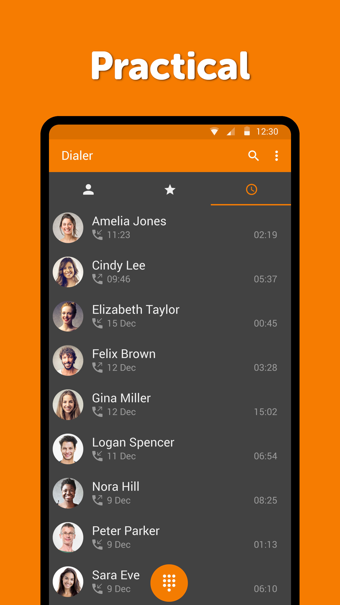
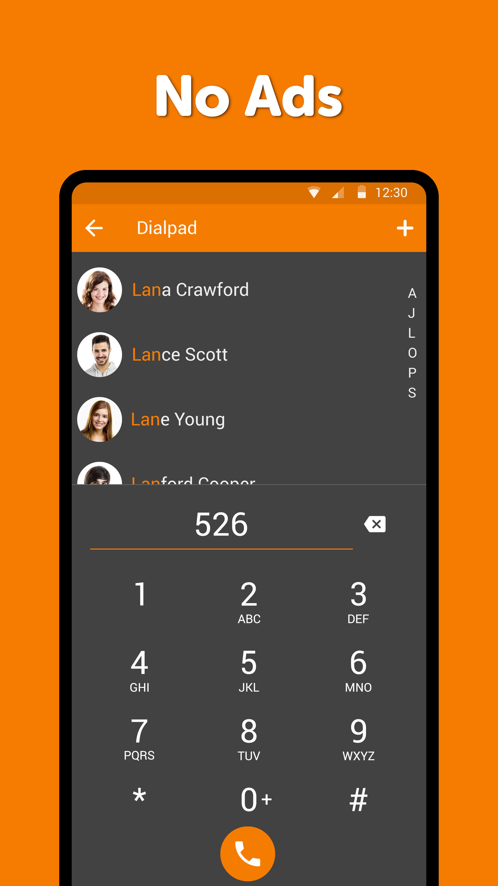
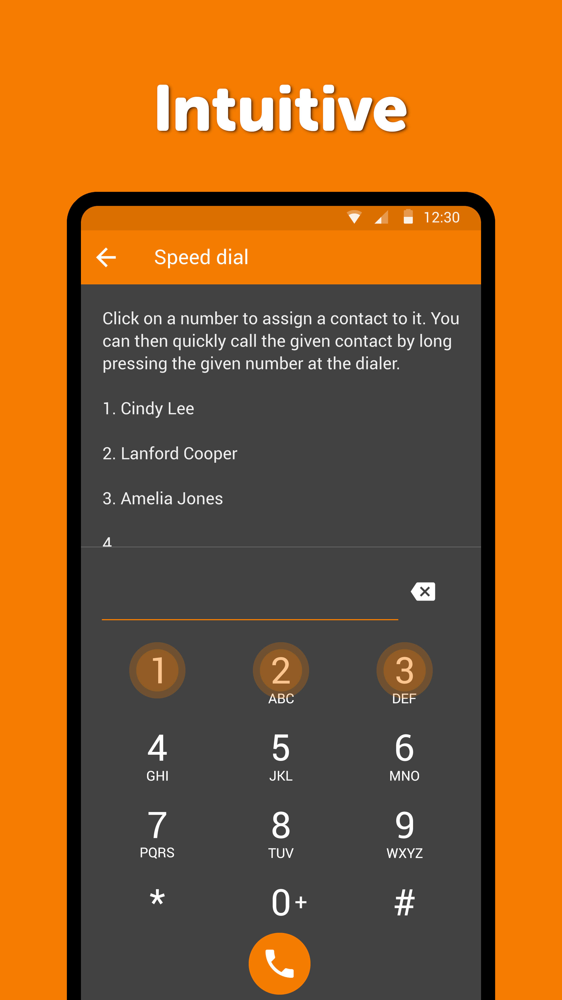

# Simple Dialer


## ⚠️ Personal Fork

This is a personal fork meant for my own use. It may contain opinionated changes, experimental features, or breaking modifications. You're welcome to use it or fork it, but don't expect support or stability guarantees.

A feature-rich phone dialer for Android with **call recording**, **auto-answer with TTS greeting**, **offline call transcription**, and more. Fork of [Simple Mobile Tools Dialer](https://github.com/SimpleMobileTools/Simple-Dialer) with significant added functionality.

## ✨ Features

### Core Dialer
- 📞 Full-featured phone dialer with contacts, favorites, and call history
- 🔢 T9 smart dialpad with contact suggestions
- 🚫 Call blocking and number management
- ⚡ Speed dial support
- 🎨 Material Design with customizable colors and dark theme

### 🎙️ Call Recording
- **Automatic call recording** — records all calls when enabled
- **Accessibility service integration** — captures both sides of the conversation reliably on Android 9+ (Samsung, Xiaomi, OnePlus, Pixel, etc.)
- **Audio source fallback chain** — tries `VOICE_CALL` → `VOICE_COMMUNICATION` → `VOICE_RECOGNITION` → `MIC` until one works
- **Custom recording folder** — save recordings to any folder via SAF
- **Step-by-step setup guide** — walks you through all required permissions

### 🗣️ Auto-Answer
- **Auto-answer modes** — all calls, unknown callers only, or disabled
- **Custom TTS greeting** — configurable text-to-speech message for callers
- **TTS engine & language selection** — pick any installed TTS engine and language
- **Per-SIM settings** — different greeting, language, and TTS engine per SIM card
- **Listen-in mode** — listen to auto-answered calls via speaker or notification toggle
- **Greeting preview** — hear what callers will hear before going live

### 📝 Offline Call Transcription
- **Vosk STT integration** — automatic offline speech-to-text after each call
- **Auto language model download** — downloads the right Vosk model based on your TTS language
- **View & share transcriptions** — from call history or post-call notification

### 📋 Post-Call Notifications
- Configurable notification actions: play recording, share, view transcription
- Call summary notification after each call

### 🧪 Testing
- **Simulate Call** — test the full auto-answer + recording + transcription flow without a real call
- Per-SIM simulation support

## 📱 Screenshots

<div style="display:flex;">



</div>

## 🚀 Setup Guide (Call Recording)

After installing, go to **Settings → Call Recording** and enable it. A setup guide will appear with 6 steps:

1. **Set as default phone app** — required for call access
2. **Grant microphone permission** — required for audio capture
3. **Allow notifications** — for recording status and post-call actions
4. **Allow restricted settings** (Android 13+) — required before enabling accessibility
5. **Enable accessibility service** — unlocks `VOICE_CALL` audio source for both-side recording
6. **Disable battery optimization** — prevents Android from killing the recording service

Each step shows ✓ when complete and can be tapped to open the relevant system setting.

## 🔧 Building

### Prerequisites
- Android Studio Hedgehog or later
- JDK 17+
- Android SDK 34

### Build

```bash
# Debug build
./gradlew assembleDebug

# Release build (requires signing config)
./gradlew assembleRelease
```

### Signing

Copy `keystore.properties_sample` to `keystore.properties` and fill in your keystore details:

```properties
storePassword=your_store_password
keyPassword=your_key_password
keyAlias=your_alias
storeFile=../path/to/your.keystore
```

## 📦 Download

Check the [Releases](https://github.com/aitorpazos/Simple-Dialer/releases) page for the latest APK.

> ⚠️ If upgrading from an older version with a different signing key, uninstall first.

## 🤝 Contributing

Contributions are welcome! Please:

1. Fork the repo
2. Create a feature branch (`git checkout -b feat/my-feature`)
3. Use [Conventional Commits](https://www.conventionalcommits.org/) (`feat:`, `fix:`, `docs:`, etc.)
4. Submit a Pull Request

## 📄 License

Licensed under the [GNU General Public License v3.0](LICENSE).

This is a fork of [Simple Mobile Tools Dialer](https://github.com/SimpleMobileTools/Simple-Dialer). Original work © Simple Mobile Tools, licensed under GPLv3.
